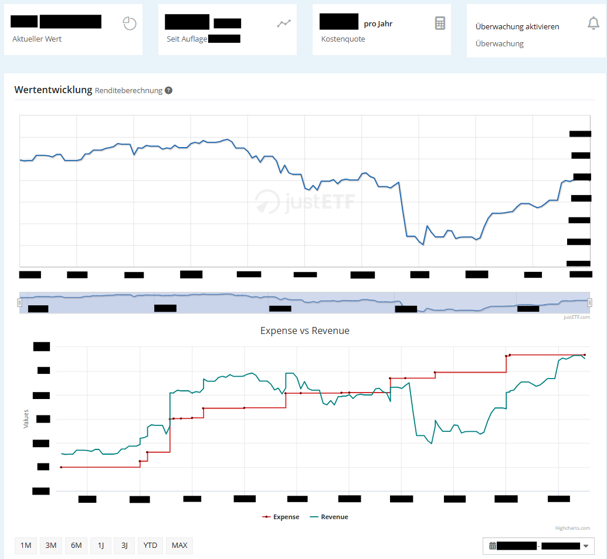

<h3 align="center">
	<a href="https://github.com/NeverRestDev"> </a>
    
	<a href="https://www.justetf.com/">JustETF</a> Expense vs Revenue Graph Script
    
</h3>

    
    
    

## Description

This script generates a dynamic graph that compares investment expenses to revenue directly on your JustETF activity site. It is designed for personal use and helps you visualize your portfolio performance effectively.

###### Note: Since the script relies on percentage-based revenue calculations from justETF rather than absolute figures, the results may include minor rounding errors.

### Preview (Censored)

## Disclaimer

This script is not affiliated with or endorsed by JustETF. It uses data from JustETF, and users are responsible for complying with JustETF's terms of service. The script is provided "as is" without any guarantees or warranties.

## Installation

1. Install [Tampermonkey](https://www.tampermonkey.net/) or a similar browser extension.
2. Visit [`investment-expense-vs-revenue-graph.user.js`](./investment-expense-vs-revenue-graph.user.js) and click on the `Raw` button.
3. Install the User Script in Tampermonkey.
4. Visit your JustETF portfolio activity page, and the graph will automatically appear below the performance chart.

**Important:** Ensure all your transactions are correctly registered on JustETF for the script to work properly. Only "Buy", "Sell", "Delivery" and "Dispatch" Transactions will be used.

## Features

-   **Dynamic Expense vs. Revenue Graph**: A dynamic graph that visualizes expenses and revenue over time.
-   **Real-Time Updates**: The graph automatically refreshes when you modify the date ranges.
-   **Automated Expense Calculation**: Expenses are calculated automatically based on your trade history.
-   **Configurable Default Start Date**: The graph comes with a preset default start date, which can be configured at [line 22](https://github.com/fl3xm3ist3r/justetf-expense-revenue-graph/blob/master/investment-expense-vs-revenue-graph.user.js#L22).
-   **Manual Adjustments for Untracked Stocks**: You can make manual adjustments for stocks that JustETF does not track. To implement this, populate the manualAdjustments array at [line 25](https://github.com/fl3xm3ist3r/justetf-expense-revenue-graph/blob/master/investment-expense-vs-revenue-graph.user.js#L25) with the desired delta adjustment amount and the specific date for which you want to apply the adjustment. These manual adjustments will be visually represented by an orange dot on the graphs.

## Contribution

Contributions are welcome! Feel free to submit issues or create pull requests to improve this repository.

## License

This script is released under the [MIT License](https://github.com/fl3xm3ist3r/justetf-expense-revenue-graph/blob/master/LICENSE), which grants the following permissions:

-   Commercial use
-   Distribution
-   Modification
-   Private use

ʕ⁠っ⁠•⁠ᴥ⁠•⁠ʔ⁠っ

